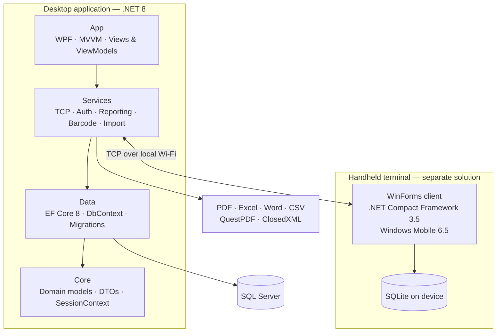

# Inventory & Stocktaking System — Case Study

A .NET 8 WPF inventory and stocktaking application for professional inventory-counting
firms, built and maintained by a single developer over 286 commits.

> **This repository contains no source code.** This is a commercial product and its
> source is private. What follows is a description of the problem, the architecture and
> the engineering decisions behind it.

---

## The problem

Professional counting firms are hired to count someone else's inventory — a supermarket
chain, a warehouse, a pharmacy group. A count is a one-shot operation: a team arrives,
counts tens of thousands of items across many locations in a single shift, and leaves with
a reconciled report. If the software fails halfway through, the count cannot simply be
restarted the next morning.

Two constraints shape everything in this product:

1. **The handheld terminals are old.** Counting firms own fleets of Windows Mobile 6.5
   devices running .NET Compact Framework 3.5. These devices work, they are already paid
   for, and replacing a fleet is expensive. Software that only supports modern Android
   scanners is not an option for these firms.
2. **The count must survive interruptions.** Wi-Fi drops, batteries die, a device is
   dropped. Counted data has to be recoverable rather than lost.

---

## Architecture

Five layers, MVVM on the UI side, with the terminal client kept as a separate solution
because it targets a completely different runtime.

The terminal client is **not** a shared project with the desktop application. It targets
.NET CF 3.5 and is built in a separate Visual Studio 2008 solution — sharing code between
a .NET 8 and a CF 3.5 target is not possible, so the boundary between them is the TCP
protocol rather than a class library.

---

## The interesting part: talking to a 2009 device

The desktop application runs a custom TCP server. Terminals connect over the local
network, receive their assigned locations, and stream counted lines back.

What made this harder than a normal client/server feature:

- **No modern tooling on the device side.** CF 3.5 has no `async`/`await`, no modern
  HTTP client, and a much smaller BCL. The protocol had to stay simple enough to
  implement twice, against two very different runtimes.
- **The device holds its own database.** Counted lines are written to SQLite on the
  device first, then synced. A dropped connection is a delay, not data loss.
- **Encoding matters.** Turkish characters do not survive a careless byte-level protocol,
  and a stocktake full of mangled product names is worthless.

---

## Testing

| Suite | Tests |
|---|---|
| Desktop | 5,188 |
| Terminal | 906 |
| SQL integration | 32 |
| **Total** | **6,126** |

*Measured 2026-08-27. All green.*

The suite includes **guard tests** — tests whose job is to fail the build when the codebase
drifts, rather than to check a feature. One of them checks that development-only code paths
never leak into a release build.

That guard was itself broken for a while, and the way it broke is worth recording: it
detected the opening and closing of a conditional block by checking whether a matched token
*contained* `if` — and `#endif` contains `if`. Every `#endif` was therefore counted as an
opening, the nesting depth never returned to zero, and after the first conditional block the
guard considered the entire rest of the file "inside a dev block". It was reporting success
while measuring nothing.

The lesson kept in the project's decision log: **a green test is not evidence until you have
seen it fail for the right reason.**

---

## Reporting, packaging and licensing

- **Reporting** — PDF, Excel, Word and CSV output via QuestPDF and ClosedXML; charts with
  LiveChartsCore and SkiaSharp; structured file logging with Serilog.
- **Packaging** — Inno Setup installer with a publish pipeline.
- **Licensing** — a hardware-locked scheme designed around RSA-2048 signatures and a machine
  fingerprint, with a per-customer terminal limit enforced server-side. Terminal-side
  licensing was deliberately dropped: the devices are old, and asking a counting crew to
  type a licence key into a 2009 handheld during a shift is a support burden that buys
  nothing.

---

## How decisions are recorded

Architecture decisions live as numbered ADRs alongside a decision ledger, so that a choice
made months ago carries its reasoning with it and does not get silently re-litigated. When
a document is superseded, it stays in place with a banner pointing at what replaced it —
the reasoning behind a rejected option is part of the record too.

---

## Tech stack

| Layer | Technology |
|---|---|
| UI | .NET 8, WPF, MaterialDesignThemes, CommunityToolkit.Mvvm |
| ORM / database | EF Core 8, SQL Server |
| Reporting | QuestPDF, ClosedXML |
| Charting | LiveChartsCore, SkiaSharp |
| Logging | Serilog |
| Testing | xUnit, Moq |
| Networking | Custom TCP server (`System.Net.Sockets`) |
| Terminal client | .NET Compact Framework 3.5, WinForms, SQLite (Windows CE) |
| Packaging | Inno Setup |

---

## Screenshots

*To be added.*

---

## Contact

Onur Buz — [github.com/OnurrrB](https://github.com/OnurrrB) ·
[linkedin.com/in/onur-buz-7b2b86308](https://www.linkedin.com/in/onur-buz-7b2b86308)
