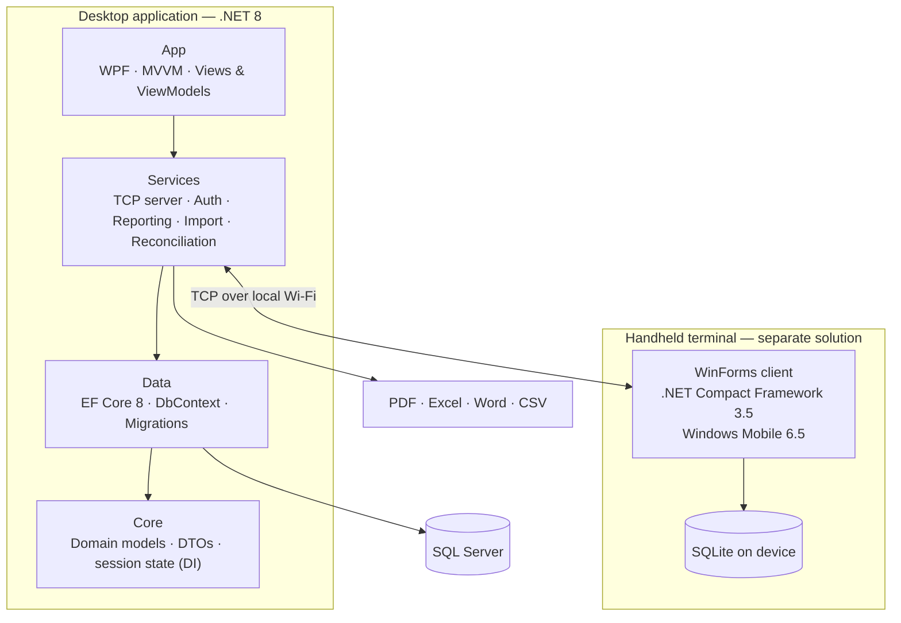

# Inventory & Stocktaking System — Case Study

A .NET 8 WPF desktop application and a Windows Mobile handheld client for professional
inventory-counting firms. Designed and written by a single developer between March and
September 2026 (about 290 commits).

> **This repository contains no source code.** The product is being prepared for sale and
> its source is private. What follows is a description of the problem, the architecture
> and the engineering decisions behind it.

**Status:** not yet in commercial use. The desktop application and the handheld client have
been tested together on a real Windows Mobile 6.5 device; there has been no field deployment
or pilot count yet.

---

## The problem

Professional counting firms are hired to count someone else's inventory — a supermarket
chain, a warehouse, a pharmacy group. A count is a one-shot operation: a team arrives,
counts many locations in a single shift, and leaves with a reconciled report. If the
software fails halfway through, the count cannot simply be restarted the next morning.

Two constraints shape everything in this product:

1. **The handheld terminals are old.** Counting firms own fleets of Windows Mobile 6.5
   devices running .NET Compact Framework 3.5. These devices work, they are already paid
   for, and replacing a fleet is expensive. Software that only supports modern Android
   scanners is not an option for these firms.
2. **The count must survive interruptions.** Wi-Fi drops, batteries die, a device is
   dropped. Counted data has to be kept on the device and recoverable, not lost with the
   connection.

---

## Architecture

A layered desktop application (MVVM on the UI side) and a handheld client kept as a separate
solution, because it targets a completely different runtime.

```mermaid
flowchart TB
    subgraph Desktop["Desktop application — .NET 8"]
        App["App<br/>WPF · MVVM · Views &amp; ViewModels"]
        Services["Services<br/>TCP server · Auth · Reporting · Import · Reconciliation"]
        Data["Data<br/>EF Core 8 · DbContext · Migrations"]
        Core["Core<br/>Domain models · DTOs · session state (DI)"]
        App --> Services --> Data --> Core
    end

    DB[("SQL Server")]
    Data --> DB

    subgraph Terminal["Handheld terminal — separate solution"]
        TApp["WinForms client<br/>.NET Compact Framework 3.5<br/>Windows Mobile 6.5"]
        TDb[("SQLite on device")]
        TApp --> TDb
    end

    Services <-->|"TCP over local Wi-Fi"| TApp

    Reports["PDF · Excel · Word · CSV"]
    Services --> Reports
```

The terminal client is **not** a shared project with the desktop application. It targets
.NET CF 3.5 and is built in a separate Visual Studio 2008 solution — sharing code between
a .NET 8 and a CF 3.5 target is not possible, so the boundary between them is the TCP
protocol rather than a class library. A separate command-line tool covers administration,
diagnostics and load testing.

---

## The interesting part: talking to a 2009 device

The desktop application runs a custom TCP server. Terminals connect over the local
network, log in, receive their catalogue and locations, and send counted lines back.

What made this harder than a normal client/server feature:

- **No modern tooling on the device side.** CF 3.5 has no `async`/`await`, no modern
  HTTP client, and a much smaller BCL. The protocol had to stay simple enough to
  implement twice, against two very different runtimes.
- **The device holds its own database.** Every scan is written to SQLite on the device
  first. The operator sends a location's lines explicitly (send / finish on the device),
  and they travel to the server in frames of up to 30 lines. A dropped connection stops
  the sending, not the counting.
- **Encoding matters.** Turkish characters do not survive a careless byte-level protocol,
  and a stocktake full of mangled product names is worthless. The protocol is UTF-8 end to
  end, and its messages are signed.

---

## Not counting twice, not losing a scan

Retries are normal on a flaky network: a frame times out, the device sends it again.
Two decisions keep that from corrupting the count.

- **Every scan stays its own row.** An early design merged repeated scans of the same
  product at the same location into one row by adding the quantities. That made a retried
  frame look like a second count and erased the audit trail, so merging was removed. Each
  scan is stored separately, and a retry is recognised by the device's identity together
  with the line's own identifier and per-device scan sequence; a line that already arrived
  is acknowledged without being written again.
- **Reconciliation against the device.** The terminal keeps its own record of what it
  counted. The desktop compares that record with what reached the server per location and
  product. Where the device has more than the server, an administrator can write back
  exactly the missing difference, recalculated at the moment of transfer, so pressing the
  button twice does not count anything twice.

A related check covers people rather than networks: a manager can mark a location for a
**blind control count**, where a second counter recounts it without seeing the first result,
and the two rounds are compared and approved on the desktop.

---

## Load test

The command-line tool can open many real TCP clients against the server. The most recent
recorded run (2026-08-27):

| | |
|---|---|
| Setup | 45 simulated terminals as TCP clients on one machine, SQL Server Express, message signing on |
| Load | 45 × 200 = 9,000 scans in frames of 30, against a 1,000-product catalogue |
| Result | 9,000 sent, 9,000 acknowledged, 0 errors, in each of four runs; database totals checked separately |
| Login P95 | 1,513 ms on a cold start, 71–100 ms on warm runs |
| Throughput | 456 scans/s cold, 855–972 scans/s warm |

This measures the server and database path. It is not a test with 45 physical devices or a
real warehouse network.

---

## Testing

| Suite | Tests |
|---|---|
| Desktop | 5,188 |
| Terminal | 906 |
| SQL integration | 32 |
| **Total** | **6,126** |

*As recorded in the project changelog on 2026-08-27, all passing.*

The suite includes **guard tests** — tests whose job is to fail the build when the codebase
drifts, rather than to check a feature. One of them checks that development-only code paths
never leak into a release build.

That guard was itself broken for a while, and the way it broke is worth recording: it
detected the opening and closing of a conditional block by checking whether a matched token
*contained* `if` — and `#endif` contains `if`. Every `#endif` was therefore counted as an
opening, the nesting depth never returned to zero, and after the first conditional block the
guard considered the entire rest of the file "inside a dev block". It was reporting success
while measuring nothing.

The lesson kept in the project's decision log: **a green test is not evidence until you have
seen it fail for the right reason.**

---

## Reporting, packaging and licensing

- **Reporting** — PDF, Excel, Word and CSV output; charts on the desktop dashboard;
  structured file logging.
- **Packaging** — a Windows installer with a publish pipeline. Updates for the handheld
  client are published from the desktop as signed packages, by authorised users only.
- **Licensing** — the desktop application is licensed per machine. Terminal-side licensing
  was deliberately dropped: the devices are old, and asking a counting crew to type a
  licence key into a 2009 handheld during a shift is a support burden that buys nothing.
- **Access** — role-based permissions and an audit log for administrative actions.

---

## How decisions are recorded

Architecture decisions live as numbered ADRs alongside a decision ledger, so that a choice
made months ago carries its reasoning with it and does not get silently re-litigated. When
a document is superseded, it stays in place with a banner pointing at what replaced it —
the reasoning behind a rejected option is part of the record too.

---

## Tech stack

| Layer | Technology |
|---|---|
| UI | .NET 8, WPF, MaterialDesignThemes, CommunityToolkit.Mvvm |
| ORM / database | EF Core 8, SQL Server |
| Reporting | QuestPDF, ClosedXML, DocX |
| Charting | LiveChartsCore, SkiaSharp |
| Logging | Serilog |
| Testing | xUnit, Moq |
| Networking | Custom TCP server (`System.Net.Sockets`) |
| Terminal client | .NET Compact Framework 3.5, WinForms, SQLite (Windows CE) |
| Packaging | Inno Setup |

---

## Screenshots

Screenshots are not published while the product is being prepared for sale. The diagram
above shows how the parts fit together.

---

## Contact

Onur Buz — [github.com/OnurrrB](https://github.com/OnurrrB) ·
[linkedin.com/in/onur-buz-7b2b86308](https://www.linkedin.com/in/onur-buz-7b2b86308)
